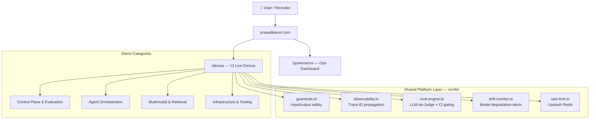

# Prasad Kavuri — AI Engineering Portfolio Platform

> **Enterprise AI, Built for Day 2** — production-grade AI platform engineering, not demos.

**Live site:** [prasadkavuri.com](https://www.prasadkavuri.com) · **Role target:** VP / Head of AI Engineering

> A production-grade AI platform built to demonstrate enterprise AI engineering depth — not just demos, but a governed, observable, evaluated system operating on shared infrastructure.

---

## Platform Architecture

The key insight: every demo on this site shares the same governance foundation. This is not a collection of standalone pages — it is a unified platform where guardrails, observability, evaluation, and drift monitoring are infrastructure-layer concerns.



Canonical diagram asset: `public/architecture-diagram.svg` · Live: https://www.prasadkavuri.com/#architecture

---

## Demo Catalog

| Demo | Category | Key AI Pattern | Business Signal |
|---|---|---|---|
| AI Evaluation Showcase | Control Plane & Evaluation | LLM-as-Judge, semantic fidelity scoring, CI eval gating | Prevents regression leakage before production |
| LLM Router | Control Plane & Evaluation | Multi-model routing by latency/cost/quality | 40–70% cost reduction through route-to-fit inference |
| Enterprise Control Plane | Control Plane & Evaluation | RBAC, token-spend analytics, OpenTelemetry event feed | Org-wide AI governance: access, spend, audit |
| Multi-Agent System | Agent Orchestration | CrewAI, HITL approval checkpoint, specialist roles | Faster cross-functional decisions with controlled autonomy |
| MCP Tool Demo | Agent Orchestration | Model Context Protocol, dynamic tool discovery | Reliable, auditable tool-use contracts at scale |
| RAG Pipeline | Multimodal & Retrieval | Transformers.js embeddings, ChromaDB, browser execution | Higher answer precision with lower support escalation |
| Vector Search | Multimodal & Retrieval | sentence-BERT, UMAP visualization, cosine retrieval | Accelerates knowledge discovery across large content repositories |
| Multimodal Assistant | Multimodal & Retrieval | Florence-2, WebGPU, in-browser OCR/captioning | Lower vision pipeline cost with local-first execution |
| Model Quantization | Infrastructure & Tooling | ONNX benchmarking, INT8 vs FP32, Transformers.js | Quantifiable inference efficiency and deployment economics |
| AI Portfolio Assistant | Infrastructure & Tooling | Vercel AI SDK streaming, retrieval-grounded context | Shortens stakeholder time-to-context for key decisions |
| Resume Generator | Infrastructure & Tooling | Structured generation, skill matching, schema.org JSON-LD | Reduces recruiting cycle time through candidate-role alignment |
| Native Browser AI Skill | Infrastructure & Tooling | Chrome Prompt API, Gemini Nano, WASM | Zero-latency, 100% private on-device inference |
| AI Spatial Intelligence & World Generation | Infrastructure & Tooling | Three.js, GLB export, provider adapter, approval gating | Governed spatial planning artifacts, simulation-ready |

---

## 2026 Production AI Patterns Implemented

- **End-to-end Trace-ID propagation** — every LLM call tagged from frontend request through completion (`src/lib/observability.ts`)
- **Human-in-the-Loop checkpoint** — explicit approval gate between Researcher and Strategist agents in the multi-agent demo
- **Closed-loop evaluation** — LLM-as-Judge scoring with CI gating; regressions blocked before deployment (`src/lib/eval-engine.ts`)
- **Model drift monitoring** — automated alerting on performance degradation across model versions (`src/lib/drift-monitor.ts`)
- **Infrastructure-layer guardrails** — competitor detection, hallucination heuristics, agent handoff validation — applied platform-wide, not per-demo (`src/lib/guardrails.ts`)
- **Semantic rate limiting** — token budget admission before upstream API call (`src/lib/cost-control.ts`)
- **SSRF prevention** — URL allowlist + redirect-hop validation (`src/lib/url-security.ts`)
- **WCAG 2.2 AA accessibility** — verified via axe-core in Playwright CI

---

## Why This Architecture Matters

Most AI portfolios show demos. This one shows a **governed AI operating model**: evaluation before deployment, human oversight on critical agent transitions, full observability from request to response, and drift detection before failures reach users.

That is the difference between a proof-of-concept and a production platform.

---

## Visual Proof

Flagship workflow proof artifact (Multi-Agent execution rail + human approval checkpoint):


---

## Local Development

```bash
# Prerequisites: Node 18+
npm install
npm run dev          # http://localhost:3000
npm run test         # unit + integration (Vitest)
npm run test:e2e     # end-to-end (Playwright)
npm run build        # production build check
npm audit --audit-level=high  # security gate
```

---

## Stack

Next.js 16.2.3 · React 19 · TypeScript · Tailwind CSS v4 ·
Vercel · Upstash Redis · Groq · Transformers.js ·
Playwright · Vitest

---

## Testing and Quality Gates

```bash
npm run test              # unit + integration (567 tests, 66 files)
npm run test:coverage     # coverage gates: API ≥90% stmts, lib ≥95% functions
npm run test:fuzz         # adversarial input tests
npm run test:evals        # LLM-as-Judge eval suite
npm run test:e2e          # Playwright: chromium, firefox, webkit, mobile
```

Coverage gates: API routes ≥90% statements / ≥85% branches; lib ≥95% functions.

---

## About

Built by Prasad Kavuri — AI Engineering Leader with 20+ years scaling production AI platforms at Krutrim, Ola, and HERE Technologies. Open to VP / Head of AI Engineering roles in the Chicago area and beyond.
