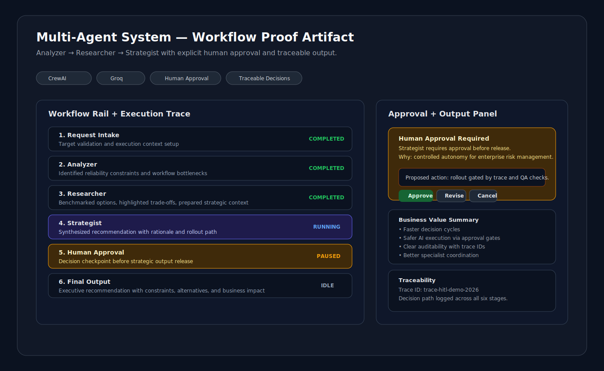

# Prasad Kavuri — AI Engineering Portfolio

Live site: https://www.prasadkavuri.com

Production-grade AI engineering portfolio for VP / Head / Sr Director evaluation. The site demonstrates how agentic AI systems are designed, governed, and operated beyond prototype stage.

## What This Portfolio Demonstrates

- **AI Evaluation Showcase (Signature System)**: closed-loop quality architecture with offline evals, semantic fidelity scoring, hallucination checks, drift monitoring, and release gating.
- **Multi-Agent System (Flagship Workflow)**: Analyzer → Researcher → Strategist orchestration with explicit human approval before strategic output release.
- **LLM Router**: model routing with latency/cost/quality trade-off framing for FinOps-aware inference decisions.
- **RAG + Vector Search**: browser-executed retrieval patterns using Transformers.js embeddings for local-first knowledge workflows.
- **Governance and Control Plane**: guardrails, RBAC signals, traceability, token-spend visibility, and enterprise trust controls.
- **MCP Tool Demo**: dynamic tool discovery/invocation pattern for auditable model-to-tool interaction.
- **Applied AI Experiences**: portfolio assistant, resume generator, multimodal inference, and quantization benchmarks.

## Live Demos (12 Production Demos)

| Demo Name | Key Technology (2026 Standards) | Business Impact (ROI) |
|---|---|---|
| AI Evaluation Showcase | LLM-as-Judge, semantic fidelity scoring, drift monitoring, CI eval gating | Prevents regression leakage and reduces rollback spend |
| Enterprise Control Plane | RBAC, token-spend analytics, OpenTelemetry event feed | Improves governance posture and enforces spend accountability |
| Multi-Agent System | CrewAI orchestration, Groq inference, HITL approval checkpoint | Faster cross-functional decisions with controlled autonomy |
| LLM Router | Multi-model routing, latency/cost telemetry, policy-based model selection | 40-70% cost reduction potential through route-to-fit inference |
| RAG Pipeline | Transformers.js embeddings, ChromaDB retrieval, browser execution | Higher answer precision with lower support escalation volume |
| Vector Search | sentence-BERT embeddings, UMAP mapping, cosine retrieval | Speeds enterprise knowledge discovery and analyst throughput |
| MCP Tool Demo | Model Context Protocol pattern, dynamic tool invocation | Increases reliability via structured tool-use contracts |
| AI Portfolio Assistant | Vercel AI SDK streaming, retrieval-grounded context injection | Shortens stakeholder time-to-context for key decisions |
| Resume Generator | Structured generation, role-fit scoring, PDF export pipeline | Reduces turnaround time for candidate-role alignment |
| Multimodal Assistant | Florence-2, WebGPU acceleration, in-browser OCR/captioning | Lowers vision pipeline cost with local-first execution |
| Model Quantization | ONNX runtime benchmarking, INT8 vs FP32 profiling | Improves inference efficiency and deployment economics |
| Native Browser AI Skill | Chrome Prompt API, Gemini Nano, WASM | Zero-latency inference and 100% privacy through on-device execution |

## Visual Proof

Flagship workflow proof artifact (Multi-Agent execution rail + human approval checkpoint):



## Architecture

Six-layer enterprise AI architecture:
`Users → AI Experience → Agentic Orchestration → Intelligence → Tools/Data → Business Outcomes`

Architecture section: https://www.prasadkavuri.com/#architecture
Canonical diagram asset: `public/architecture-diagram.svg`

## Trust, Governance, and Quality Posture

- Human-in-the-loop checkpoint for high-impact strategist output
- Prompt injection and output-safety guardrails in shared AI route controls
- Trace ID propagation for request-level auditability
- Drift snapshots + eval gating to reduce regression risk
- Rate limiting and abuse controls for production-safe exposure

## Stack

Next.js · TypeScript · Tailwind CSS · CrewAI · Groq · Transformers.js · ChromaDB · ONNX · OpenTelemetry · Upstash

## Local Development

```bash
npm install
npm run dev
```

Open http://localhost:3000

## Testing and Quality Gates

```bash
npm test
npm run build
```

The repository includes component, API, integration, evaluation, fuzz, resilience, and Playwright coverage to keep demo behavior and trust controls reliable.

## About

Built by Prasad Kavuri — AI Engineering Leader with 20+ years scaling production AI platforms at Krutrim, Ola, and HERE Technologies. Open to VP / Head of AI Engineering roles in the Chicago area and beyond.
