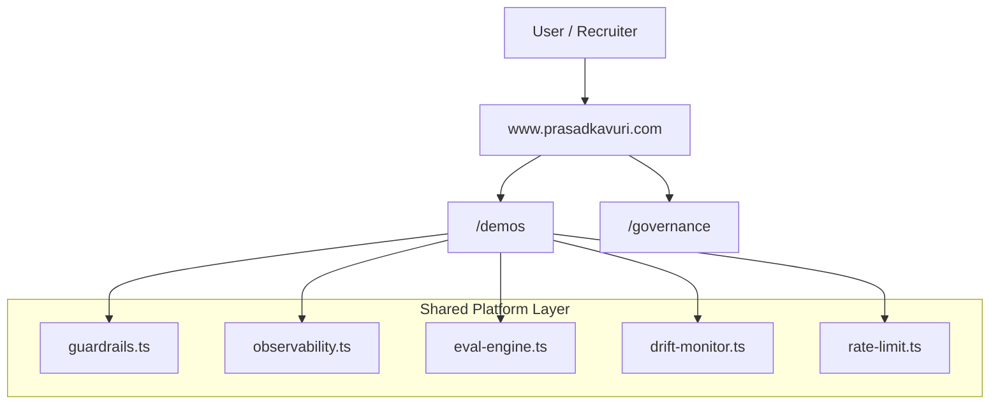

# Prasad Kavuri — AI Engineering Portfolio Platform


Enterprise AI, built for Day 2: a production-style portfolio platform that demonstrates governed, observable, evaluated AI systems instead of isolated demo pages.

Live site: [www.prasadkavuri.com](https://www.prasadkavuri.com)  
Role target: VP / Head of AI Engineering

## What This Repo Is

This repository is a unified AI platform simulation for executive and technical review.

Core differentiator: every demo shares platform-level controls in `src/lib/`.

- Guardrails and safety enforcement (`guardrails.ts`)
- Observability and trace propagation (`observability.ts`)
- Evaluation and regression gates (`eval-engine.ts`)
- Drift and runtime quality posture (`drift-monitor.ts`)
- Rate limiting and runtime controls (`rate-limit.ts`, `cost-control.ts`)

## Platform Architecture



Canonical diagram asset: `public/architecture-diagram.svg`  
Live architecture section: [www.prasadkavuri.com/#architecture](https://www.prasadkavuri.com/#architecture)

## Demo Catalog

Canonical source of demos: `src/data/demos.ts`.

Categories:
- Control plane and evaluation
- Agent orchestration
- Retrieval and multimodal systems
- Infrastructure and tooling experiences

Current count is derived from `src/data/demos.ts` and surfaced in UI/metadata.

## Governance, Testing, and Security Posture

- Centralized guardrails and output safety checks
- HITL checkpoint patterns for high-impact transitions
- Trace-ID propagation and audit-friendly observability
- CI-enforced quality gates and coverage thresholds
- Security headers, SSRF protections, and rate limiting

Run quality checks:

```bash
npm run lint
npm run test
npm run test:coverage
npm run build
npm audit --audit-level=high
```

## Local Development

```bash
# Prerequisites: Node 18+
npm install
npm run dev
```

App: http://localhost:3000

## SEO and Discoverability Notes

- Canonical host is `https://www.prasadkavuri.com`
- Legacy `.html` demo URLs are permanently redirected to canonical routes
- Canonical demo index is `/demos`
- Sitemap/robots/metadata are aligned to canonical paths

## Release Prep

- Recommended first public tag: `v1.0.0`
- Changelog: `CHANGELOG.md`
- First public release note template: `docs/releases/first-public-release.md`

## About

Built by Prasad Kavuri — AI engineering leader with 20+ years across Krutrim, Ola, and HERE Technologies, focused on production AI systems with governance, cost discipline, and measurable business outcomes.
