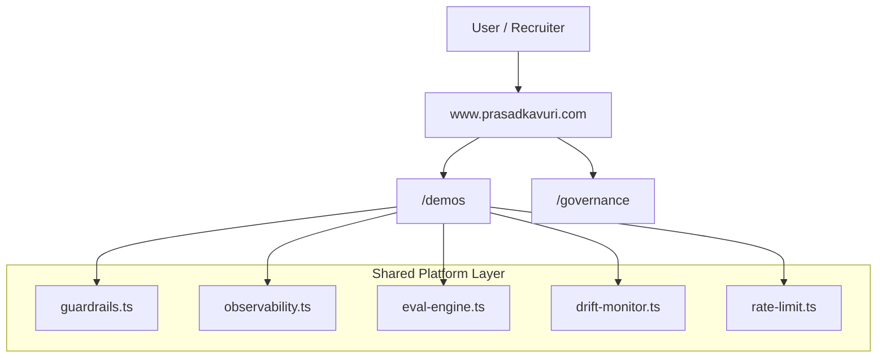

# Prasad Kavuri — VP / Head of AI Engineering


20 years building AI platforms at enterprise scale — from Krutrim's agentic AI (India's first) to Ola Maps at 13,000+ B2B customers. This portfolio demonstrates governed, observable, evaluated AI systems running in production, not isolated demo pages.

| Metric | Signal |
|--------|--------|
| 200+ engineers led | Krutrim, Ola, HERE Technologies — US, Europe, India |
| 70% cost reduction | FinOps-aware LLM routing and inference optimization at Ola |
| 13,000+ B2B customers | Enterprise API platform at Ola Maps |
| 13 live AI demos | Eval-gated, observable, production-pattern systems |

**Live site:** [www.prasadkavuri.com](https://www.prasadkavuri.com) · **For recruiters:** [/for-recruiters](https://www.prasadkavuri.com/for-recruiters) · **Contact:** vbkpkavuri@gmail.com

Role target: VP / Head of AI Engineering — Chicago area or remote  
Current release: [v1.0.0](CHANGELOG.md)

## Stack

- **Next.js 16.2.4** (App Router + Turbopack) · React 19.2.5 · TypeScript 5.9.3 · Tailwind CSS 4.2.4
- **LLM inference**: Groq SDK 1.1.2 (server-side) · Transformers.js 4.2.0 (browser WASM) · Florence-2 (WebGPU)
- **Platform controls**: Upstash Redis (rate limiting) · structured observability logs · Vitest 4.1.5 + Playwright 1.59.1
- **Deployment**: Vercel (serverless API routes + static assets)

## What This Repo Is

This repository is a unified AI platform simulation for executive and technical review.

Core differentiator: every demo shares platform-level controls in `src/lib/`.

- Guardrails and safety enforcement (`guardrails.ts`)
- Observability and trace propagation (`observability.ts`)
- Evaluation and regression gates (`eval-engine.ts`)
- Drift and runtime quality posture (`drift-monitor.ts`)
- Rate limiting and runtime controls (`rate-limit.ts`, `cost-control.ts`)

---
### 🤖 Agent Skill — AI-Assisted Development

This repo includes an installable agent skill for Claude Code, Cursor, Copilot,
and 40+ other coding agents. Install it once and your agent understands the
full codebase — stack, governance rules, file map, and conventions — before
touching a single file.

```bash
npx skills add prasad-kavuri/prasad-portfolio
```

No setup required. The skill auto-loads in Claude Code sessions.
Browse on [skills.sh →](https://skills.sh)
---

## How To Read This Repo (Recruiters and CTOs)

If you are reviewing this repository for VP / Head / Senior Director AI Platform fit, use this path:

1. `/for-recruiters` for executive summary and role-fit context
2. `/capabilities` for capability-to-evidence mapping
3. `/demos` for live system behavior
4. `/governance` for trust, guardrails, and operational controls
5. `/certifications` for recency-weighted AI validation signal

This sequence is designed to show system thinking first, then implementation evidence.

## Platform Capability Map

The portfolio is organized around enterprise AI platform capability areas, not isolated demos:

- Agentic AI systems and controlled orchestration
- Tool and MCP-style integration patterns
- LLM routing and model selection economics
- RAG and retrieval grounding
- Vector search and semantic ranking
- Governance, HITL, and policy controls
- Observability, reliability, and fallback behavior
- AI FinOps (cost and latency discipline)
- Platform modernization and executive operating model

Canonical capability route: `/capabilities`

## Platform Architecture



Canonical diagram asset: `public/architecture-diagram.svg`  
Live architecture section: [www.prasadkavuri.com/#architecture](https://www.prasadkavuri.com/#architecture)

## Demo Catalog

Canonical source: `src/data/demos.ts` — 13 live demos as of v1.0.0.

| Demo | Route | Engine / Stack | Mode |
|------|-------|----------------|------|
| RAG Pipeline | `/demos/rag-pipeline` | Transformers.js · all-MiniLM-L6-v2 · ChromaDB | Browser WASM |
| LLM Router | `/demos/llm-router` | Groq · Llama 3.1 8B / 70B · Mixtral | Server |
| Vector Search | `/demos/vector-search` | sentence-BERT · UMAP · Cosine similarity | Browser WASM |
| AI Evaluation Showcase | `/demos/evaluation-showcase` | LLM-as-Judge · Guardrails · CI gating | Server |
| Multi-Agent System | `/demos/multi-agent` | CrewAI · Groq · Llama 3.3 70B | Server |
| MCP Tool Demo | `/demos/mcp-demo` | MCP protocol · Groq tool calling | Server |
| AI Portfolio Assistant | `/demos/portfolio-assistant` | Vercel AI SDK · Streaming · RAG grounding | Server |
| Resume Generator | `/demos/resume-generator` | Groq · JD parsing · Skill matching | Server |
| Multimodal Assistant | `/demos/multimodal` | Florence-2 · WebGPU · Transformers.js | Browser WebGPU |
| Model Quantization | `/demos/quantization` | ONNX · INT8 vs FP32 · Transformers.js | Browser WASM |
| Enterprise Control Plane | `/demos/enterprise-control-plane` | RBAC · Structured observability · Token analytics | Server |
| Native Browser AI Skill | `/demos/browser-native-ai-skill` | Chrome Prompt API · Gemini Nano | Browser |
| AI Spatial Intelligence | `/demos/world-generation` | Three.js · GLB export · Governance gates | Server + Browser |

```
src/app/demos/
├── browser-native-ai-skill/
├── enterprise-control-plane/
├── evaluation-showcase/
├── llm-router/
├── mcp-demo/
├── multi-agent/
├── multimodal/
├── page.tsx                  ← /demos index
├── portfolio-assistant/
├── quantization/
├── rag-pipeline/
├── resume-generator/
├── spatial-simulation/       ← permanent redirect → /demos/world-generation
├── vector-search/
└── world-generation/
```

## Governance, Testing, and Security Posture

- Centralized guardrails and output safety checks
- HITL checkpoint patterns for high-impact transitions
- Trace-ID propagation and audit-friendly observability
- CI-enforced quality gates and coverage thresholds
- Security headers, SSRF protections, and rate limiting
- Agent sandbox contract for Codex, Claude Code, Cursor, Copilot, and skills.sh workflows
- Documented threat model and machine-readable trust signal:
  [`docs/SECURITY_THREAT_MODEL.md`](docs/SECURITY_THREAT_MODEL.md) and
  [`/.well-known/security-posture.json`](public/.well-known/security-posture.json)

Run quality checks:

```bash
npm run lint
npm run test
npm run test:coverage
npm run build
npm audit --audit-level=high
```

## Development

```bash
# Prerequisites: Node 18+
npm install
npm run dev
```

App: http://localhost:3000

## SEO and Discoverability Notes

- Canonical host is `https://www.prasadkavuri.com`
- Legacy `.html` demo URLs are permanently redirected to canonical routes
- Canonical demo index is `/demos`
- Sitemap/robots/metadata are aligned to canonical paths

## Release

**Current release: v1.0.0** — [Changelog](CHANGELOG.md) · [Release notes](docs/releases/first-public-release.md)

Tag and publish via GitHub Releases pointing to the `main` branch.  
See `docs/releases/RELEASE_CHECKLIST.md` for the release checklist.

## About

Built by Prasad Kavuri — AI engineering leader with 20+ years across Krutrim, Ola, and HERE Technologies, focused on production AI systems with governance, cost discipline, and measurable business outcomes.
