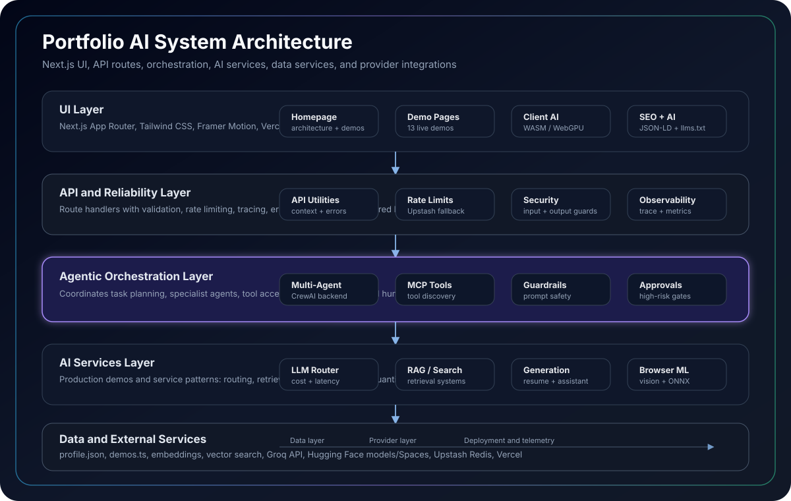

# Prasad Kavuri — Head of AI Platform & Agentic Solutions

**prasadkavuri.com** · [LinkedIn](https://linkedin.com/in/pkavuri) · vbkpkavuri@gmail.com

> Production AI platform portfolio: 9 core platform demos + 4 labs, all live. Built for VP / Head-level evaluation.

---

## 👋 For Recruiters & Hiring Managers

**Start here → [prasadkavuri.com/for-recruiters](https://www.prasadkavuri.com/for-recruiters)**

| Step | Link | Time |
|------|------|------|
| 1. Capability map | [prasadkavuri.com/capabilities](https://www.prasadkavuri.com/capabilities) | 30 sec |
| 2. Flagship demo | [Evaluation Showcase](https://www.prasadkavuri.com/demos/evaluation-showcase) | 60 sec |
| 3. Governance controls | [prasadkavuri.com/governance](https://www.prasadkavuri.com/governance) | 45 sec |
| 4. Book a conversation | [calendly.com/vbkpkavuri](https://calendly.com/vbkpkavuri) | 30 sec |

---

## About

**Prasad Kavuri** — Head of AI Platform & Agentic Solutions (at Zip) with 20+ years building
production AI platforms at enterprise scale.

| Metric | Result |
|--------|--------|
| Engineers led | 200+ across Krutrim, Ola & HERE Technologies |
| Infrastructure cost reduction | 70% at Ola (cloud-native overhaul; 13K+ B2B customers) |
| Revenue launched | $10M+ (Krutrim AI / Kruti.ai, 0 → production) |
| Production AI platform | India's first agentic AI platform |
| Experience | 20+ years, AI/ML → Agentic AI |

Chicago area & remote.

---

## Live Portfolio

**[prasadkavuri.com](https://www.prasadkavuri.com)** — 13 live AI demos (9 core platform + 4 labs)
running on shared governance infrastructure: guardrails, observability,
evaluation, and drift monitoring at the platform layer.

### Demo highlights

| Demo | Category | Signal |
|------|----------|--------|
| [AI Evaluation Showcase](https://www.prasadkavuri.com/demos/evaluation-showcase) | Flagship | Rubric-scored evals, release gating, CI eval suites |
| [Multi-Agent System](https://www.prasadkavuri.com/demos/multi-agent) | Agentic | Groq agents, server-enforced release approval, audit trails |
| [RAG Pipeline](https://www.prasadkavuri.com/demos/rag-pipeline) | Infrastructure | Transformers.js embeddings, in-browser retrieval, citations |
| [LLM Router](https://www.prasadkavuri.com/demos/llm-router) | FinOps | Multi-model routing, live cost/latency tradeoffs |
| [Enterprise Control Plane](https://www.prasadkavuri.com/demos/enterprise-control-plane) | Governance | RBAC, spend limits, structured observability |
| [Edge Agent Collaboration](https://www.prasadkavuri.com/demos/edge-agent-collaboration) | Privacy-first | BERT NER redaction, HITL gate, sovereign AI |

---

## Stack

Next.js 16 · React 19 · TypeScript 6 · Tailwind CSS 4 · Transformers.js ·
Vercel · Upstash Redis · Groq · Playwright · Vitest

**Quality baseline:** Vitest unit/integration/eval suites · npm audit, gitleaks, semgrep · 0 lint errors · CI: lint → unit → build → E2E matrix

---

## Architecture

Full architecture: [ARCHITECTURE.md](./docs/ARCHITECTURE.md) · Security: [SECURITY.md](./SECURITY.md)

---

## Machine-Readable Identity

| File | Purpose |
|------|---------|
| [/llms.txt](https://www.prasadkavuri.com/llms.txt) | Fast-parse AI agent identity |
| [/llms-full.txt](https://www.prasadkavuri.com/llms-full.txt) | Full capability context |
| [/ai-profile.json](https://www.prasadkavuri.com/ai-profile.json) | Structured identity |
| [/about](https://www.prasadkavuri.com/about) | Canonical entity profile + JSON-LD |

---

*Chicago area & remote*  
*Contact: vbkpkavuri@gmail.com · [LinkedIn](https://linkedin.com/in/pkavuri) · [Book a call](https://calendly.com/vbkpkavuri)*
