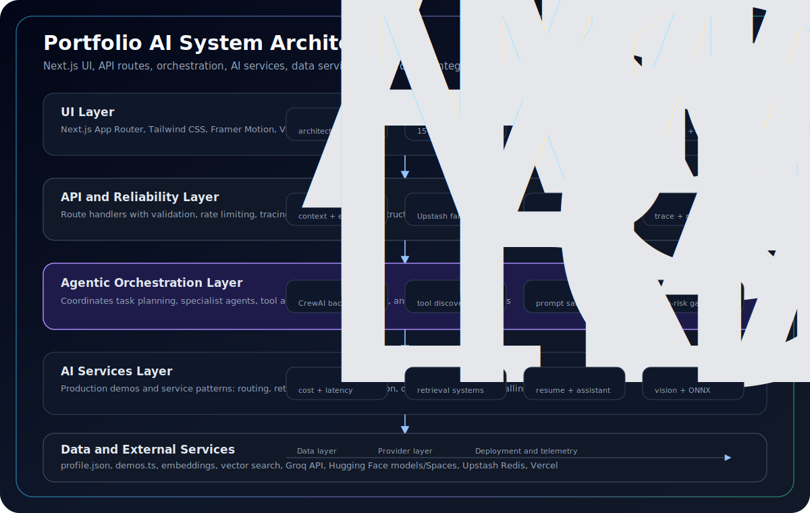

# Portfolio AI System Architecture



This document describes the real system architecture implemented in this repository. It keeps the website architecture section, README, and implementation-facing docs aligned around the same artifact: `public/architecture-diagram.svg`.

## System Layers

| Layer | Repo implementation | Purpose |
|---|---|---|
| UI Layer | `src/app/page.tsx`, `src/components/sections/*`, `src/data/demos.ts` | Presents the portfolio, architecture section, and 12 production demos |
| API and Reliability Layer | `src/app/api/*/route.ts`, `src/lib/api.ts`, `src/lib/rate-limit.ts`, `src/lib/observability.ts` | Standardizes validation, rate limits, tracing, error responses, and structured logs |
| Agentic Orchestration Layer | `/api/multi-agent`, `/api/mcp-demo`, `src/app/demos/multi-agent`, `src/app/demos/mcp-demo` | Demonstrates agent coordination, tool discovery, specialist roles, and guarded execution patterns |
| AI Services Layer | LLM Router, RAG, AI Portfolio Assistant, Resume Generator, Multimodal, Quantization | Hosts the live AI capabilities shown on the site |
| Data Layer | `src/data/profile.json`, `src/data/demos.ts`, browser embeddings, retrieved context, static public assets | Supplies profile data, demo metadata, embeddings, and knowledge context |
| External Services | Groq, Hugging Face models/Spaces, Upstash Redis, Vercel Analytics and Speed Insights | Provides hosted inference, agent backends, distributed rate limiting, and telemetry |

## API Routes

The current API surface is:

| Route | Capability | Main implementation notes |
|---|---|---|
| `/api/llm-router` | Multi-model routing | Calls Groq models, returns latency/cost metrics, validates prompt/model input |
| `/api/portfolio-assistant` | Full-context streaming assistant | Streams Groq responses with curated knowledge injection and optional retrieval grounding cues |
| `/api/resume-generator` | Resume tailoring | Parses job descriptions and returns structured resume JSON |
| `/api/multi-agent` | Multi-agent analysis | Proxies to the agent backend with hardened SSRF checks via `src/lib/url-security.ts` |
| `/api/mcp-demo` | MCP-style tool calling | Lets Groq select and execute profile tools via a JSON-RPC-like tool schema |
| `/api/resume-download` | Resume redirect | Rate-limited redirect to the public PDF asset |

All routes use the shared helpers in `src/lib/api.ts` for request context, errors, rate-limit headers, and response finalization.

## Orchestration

The orchestration layer is represented by two production-facing demos:

- `multi-agent`: models analyzer, researcher, and strategist roles, with backend execution handled through a remote agent service.
- `mcp-demo`: exposes deterministic profile tools such as experience lookup, skill search, fit scoring, and achievement retrieval.

The intent is to show the architecture pattern rather than hide it behind a single chat box: narrow agents, explicit tools, and auditable handoffs.

## Routing and AI Services

The AI services layer contains both server-side and browser-side demos:

| Demo | Path | Execution mode |
|---|---|---|
| RAG Pipeline | `/demos/rag-pipeline` | Browser embeddings and retrieval |
| LLM Router | `/demos/llm-router` | Server route calling Groq |
| Vector Search | `/demos/vector-search` | Browser embeddings and visualization |
| AI Evaluation Showcase | `/demos/evaluation-showcase` | LLM-as-Judge eval pipeline, guardrails, CI gating |
| Multi-Agent System | `/demos/multi-agent` | Server route plus external agent backend |
| MCP Tool Demo | `/demos/mcp-demo` | Server route calling Groq tool use |
| AI Portfolio Assistant | `/demos/portfolio-assistant` | Server route with streaming full-context grounding and retrieval cues |
| Resume Generator | `/demos/resume-generator` | Server route calling Groq |
| Multimodal Assistant | `/demos/multimodal` | Browser model execution |
| Model Quantization | `/demos/quantization` | Browser ONNX benchmark |
| Enterprise Control Plane | `/demos/enterprise-control-plane` | RBAC, spend governance, token analytics, OTEL observability |
| Native Browser AI Skill | `/demos/browser-native-ai-skill` | On-device accessibility and agent-readiness analysis |

The LLM Router demonstrates the cost/latency tradeoff pattern directly. RAG and vector search demonstrate retrieval before generation. Browser demos show local inference patterns that reduce server load and external API cost.

## Data Layer

The primary repo data sources are:

- `src/data/profile.json`: professional profile, experience, skills, education, and summary copy.
- `src/data/demos.ts`: demo metadata, route paths, technology tags, and business impact lines.
- Browser embeddings and vector search state in the RAG/vector demos.
- Public assets in `public/`, including `profile-photo.jpg`, `Prasad_Kavuri_Resume.pdf`, and `architecture-diagram.svg`.

There is no hidden database for the portfolio content. The repo intentionally keeps public profile data auditable and versioned.

## Security Layers

Security controls are implemented at route boundaries and platform configuration:

- `src/lib/api.ts` validates JSON bodies, standardizes error responses, adds request IDs, and finalizes responses with trace and rate-limit headers.
- `src/lib/rate-limit.ts` provides Upstash Redis sliding-window rate limiting in production with an in-memory fallback for local/test runs.
- `src/lib/guardrails.ts` is the canonical guardrail module for prompt-injection detection and server-side LLM output sanitization.
- `src/lib/url-security.ts` centralizes outbound URL hardening for SSRF prevention (private/internal IPv4, IPv6 local ranges, encoded-IP forms, and credentialed URL blocking).
- `src/lib/safe-fetch.ts` provides a reusable server-side outbound fetch wrapper with URL allowlisting and redirect-hop validation.
- `detectPromptInjection` / `isPromptInjection` block prompt-injection patterns before LLM calls.
- `sanitizeLLMOutput` strips script tags, event handlers, and `javascript:` URIs from LLM output.
- API routes enforce input shape and length limits before external calls.
- Middleware/proxy and Next config provide HTTP security headers such as CSP and COOP/COEP where needed.
- CI runs `npm audit --audit-level=high`, lint, unit coverage, and Playwright checks across chromium, firefox, webkit, and mobile projects.

## Snapshot Telemetry Data

Status and governance pages use `src/data/telemetry-snapshots.ts` as a centralized source for precise snapshot timestamps, service inventory, posture summaries, policy controls, audit records, and deterministic metric values. Governance metric cards are assembled through `getGovernanceMetricsView(...)`, then optionally augmented with live `/api/eval-snapshot` values when available.

## Observability

The reliability layer includes lightweight observability without adding a heavy monitoring dependency:

- `createRequestContext` generates or accepts request trace IDs.
- Responses include `X-Request-Id`, `X-Trace-Id`, `Server-Timing`, and `X-RateLimit-*` headers when applicable.
- `logApiEvent`, `logApiWarning`, and `logApiError` write structured JSON logs.
- `captureAPIError` emits sanitized error monitoring events without leaking raw error messages.
- `trackAPIRequest` and `trackRateLimit` maintain in-memory counters used by tests and local diagnostics.
- `detectAnomaly` flags slow responses and 5xx responses for abnormal usage logging.

## Diagram Ownership

The canonical architecture artifact is:

```text
public/architecture-diagram.svg
```

The website renders it in `src/components/sections/Architecture.tsx`. README and this document embed the same file. If the API routes, demo list, or external services change, update the SVG and this document in the same change.

## Patentable Patterns

The following design patterns in this portfolio represent novel combinations of techniques that are not commonly implemented together in production AI systems. They are documented here for intellectual property purposes.

### 1. Semantic Rate Limiting

**Pattern:** Rate limits enforced at the semantic layer (token budget) rather than purely at the HTTP layer (request count).

`src/lib/cost-control.ts` estimates token consumption from raw prompt text before any API call is made. If the estimated cost of a request would exceed the per-IP budget window, the request is rejected at the edge — before Groq is contacted — eliminating wasted upstream spend.

Combined with IP-level SHA-256 hashing (never raw IPs in storage), this creates a privacy-preserving, cost-aware admission controller that operates in sub-millisecond time.

**Novel combination:** HTTP rate limiter + token budget estimator + privacy-preserving IP hash + upstream cost isolation, operating as a unified admission gate.

---

### 2. Cross-Model Orchestration Topology

**Pattern:** A single orchestrator routes queries across heterogeneous models selected per-task by complexity and latency requirements — not by a static routing table.

`src/app/api/llm-router/route.ts` implements dynamic routing: simple factual queries go to `llama-3.1-8b-instant`, moderate queries to `llama-3.3-70b`, and complex multi-step queries to `llama-4-scout`. The router reasons about query structure at inference time rather than relying on pre-classified categories.

**Novel combination:** Real-time query complexity scoring + per-call model selection + unified streaming response format across models of different capability tiers.

---

### 3. Autonomous Tool Discovery via MCP

**Pattern:** The assistant discovers available tools at runtime through the Model Context Protocol manifest rather than having them hardcoded in the system prompt.

`src/app/api/mcp-demo/route.ts` exposes a self-describing tool registry. The LLM receives a dynamic tool manifest per request, selects the appropriate tool, and executes it — all within a single request/response cycle without any out-of-band configuration.

**Novel combination:** Dynamic tool manifest injection + LLM-driven tool selection + structured output parsing + single-round-trip tool execution.

---

### 4. Closed-Loop Evaluation Pipeline

**Pattern:** Production prompts are continuously evaluated against a ground-truth eval suite that runs in CI, closing the loop between deployment and accuracy regression.

`src/__tests__/evals/` contains LLM-as-Judge eval cases (`EvalCase`) with required coverage terms and forbidden topic lists. `scoreResponse` in `src/lib/eval-engine.ts` computes a numeric accuracy score. These run on every commit via `npm run test:evals` — prompt regressions block deployment exactly like failing unit tests.

**Novel combination:** Offline eval scoring (no live API calls) + coverage-based accuracy metric + forbidden-topic penalty + CI integration as a quality gate.

---

### 5. Centralized AI Guardrails Layer

**Pattern:** Guardrails are implemented as a shared platform control plane rather than duplicated route-level utilities.

`src/lib/guardrails.ts` is the canonical module for prompt-injection detection, server-side sanitization, competitor filtering, hallucination heuristics, and agent handoff validation. API routes call this shared module at trust boundaries before upstream model calls and before returning model output.

Architecturally, this centralization reduces drift risk across routes, improves auditability, and keeps policy enforcement changes versioned in one place. The result is a consistent governance boundary for multi-route AI systems.

**Novel combination:** Single guardrail source of truth + route boundary enforcement + reusable issue scoring + compatibility-safe integration across heterogeneous AI endpoints.

---

### 6. Evaluation as Deployment Infrastructure

**Pattern:** Evaluation is treated as production infrastructure, not experiment tooling.

`src/lib/eval-engine.ts` scores responses with LLM-as-Judge style checks, `src/lib/drift-monitor.ts` tracks live output drift signals, and `src/app/api/eval-snapshot/route.ts` surfaces runtime posture. CI gates combine these signals with regression thresholds so quality failures block merges before deployment.

This architecture turns evals into an operational feedback loop: scoring, drift observation, regression detection, and release gating are connected as one lifecycle.

**Novel combination:** Runtime quality telemetry + offline eval corpus + drift-aware scoring + CI enforcement as a unified release-control mechanism.

---

## AI ROI & Governance Model

Without governance controls, hallucinations become a business problem: customer-facing errors erode trust, teams spend cycles on incident response and rollback, and leadership loses confidence in deploying AI to revenue-critical workflows. The risk is not just model quality drift; it is the compounding cost of bad decisions reaching production before anyone can intervene.

This platform addresses that risk as an operating discipline. Eval gating catches regressions before release, reducing rollback and support cost. The HITL checkpoint between Researcher and Strategist prevents unreviewed agent decisions from propagating on high-stakes transitions. Drift monitoring surfaces degradation early, before customers experience it as failure. Centralized observability with trace IDs makes decisions fully auditable end-to-end. Guardrails enforce abuse prevention and input/output safety at the infrastructure layer, so protection does not depend on each feature team re-implementing policy logic.

The operating model is governance-first rather than demo-first: evaluation before deployment, human oversight on critical paths, and full observability from request to response. The result is an AI platform that can scale responsibly, with measurable control over quality, risk, and cost.

## Synthesis

Taken together, orchestration, centralized guardrails, evaluation loops, and observability are treated here as first-class architectural primitives. That framing shifts the system from demo-centric AI to production AI platform engineering: governed, measurable, traceable, and release-safe.
